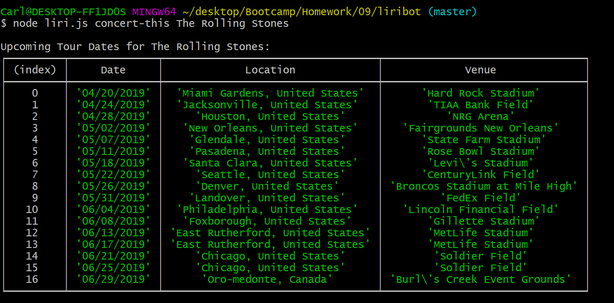
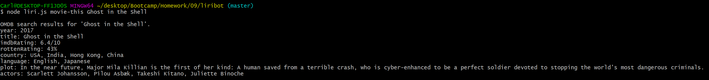
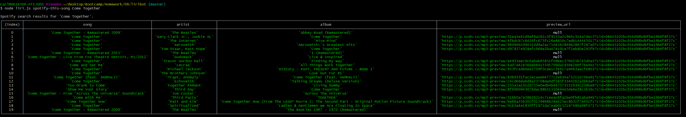

# liribot

Liribot is a CLI helper which can be used to look up information on songs, concert tour dates, and movies using various APIs.

## Usage

node liri.js `<command>` `<search terms>`

## Commands Available

### concert-this

* This command uses the bandsintown api to gather upcoming tour dates for an inputted artist/band.
[bandsInTown](https://app.swaggerhub.com/apis-docs/Bandsintown/PublicAPI/3.0.0#/artist%20events/artistEvents)

### movie-this

* This command uses the OMDB api to gather information for an inputted movie.
[OMDB](http://www.omdbapi.com/)

### spotify-this-song

* This command uses the Spotify api to gather a list of songs relating to the inputted search term.
[Spotify](https://developer.spotify.com/)

### do-what-it-says

* This command grabs, at random, an entry in the random.txt file and uses that to do a search using one of the above 3 commands, displaying the result.

## Modules used

* axios - *for calling to BandsInTown and OMBD*
* dotenv - *for storing our spotify key*
* moment - *for converting tour dates to our desired format*
* node-spotify-api - *for calling to Spotify*
* fs - *for reading and writing to our text files*

### Possible Future Updates

The preview urls for Spotify songs are quite long for displaying. If we were going to be displaying their text in the future, using a URL shortener would be a welcome update.